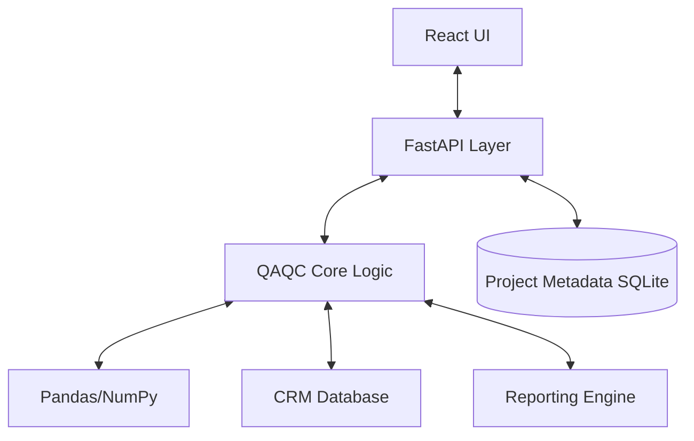

# QAQC Backend Integration Plan

This document outlines the architecture and roadmap for connecting the new React-based UI (`react_ui/`) with the existing Python QAQC analysis core (`src/`).

## 1. Architecture Overview

The system will transition from a standalone desktop app (PyQt) to a client-server architecture, allowing the same core logic to power both local desktop (via Electron or local server) and web-based deployments.



## 2. Technology Stack

- **Server Framework**: [FastAPI](https://fastapi.tiangolo.com/) (High performance, easy validation with Pydantic).
- **Data Validation**: [Pydantic](https://docs.pydantic.dev/) (Shared schemas for requests/responses).
- **Project Storage**: [SQLite](https://www.sqlite.org/) (Lightweight metadata storage for sessions).
- **File Handling**: `python-multipart` for uploads, `pandas` for processing.

## 3. API Endpoints Draft

### 3.1 Project Management
| Method | Endpoint | Description |
|--------|----------|-------------|
| `GET` | `/api/projects` | List recent projects/sessions |
| `POST` | `/api/projects` | Create a new analysis session |
| `GET` | `/api/projects/{id}` | Load full project state |
| `PUT` | `/api/projects/{id}` | Update project metadata |

### 3.2 Data Import
| Method | Endpoint | Description |
|--------|----------|-------------|
| `POST` | `/api/upload` | Upload raw assay file (CSV/XLSX) |
| `POST` | `/api/map-columns` | Submit column mapping configuration |
| `GET` | `/api/preview/{file_id}` | Get paginated preview of uploaded data |

### 3.3 Analysis Configuration
| Method | Endpoint | Description |
|--------|----------|-------------|
| `GET` | `/api/crms` | Search/List available CRMs from database |
| `POST` | `/api/config/methodology` | Save assay method/duplicate settings |
| `POST` | `/api/config/rules` | Save QAQC tolerance rules |

### 3.4 Execution & Results
| Method | Endpoint | Description |
|--------|----------|-------------|
| `POST` | `/api/analyze` | Run analysis engine on current dataset |
| `GET` | `/api/results/summary` | Get high-level pass/fail stats |
| `GET` | `/api/results/standards` | Get control chart data points |
| `GET` | `/api/results/blanks` | Get blank contamination data |
| `GET` | `/api/results/duplicates` | Get scatter plot data |

### 3.5 Export
| Method | Endpoint | Description |
|--------|----------|-------------|
| `POST` | `/api/export/pdf` | Generate and download PDF report |
| `POST` | `/api/export/excel` | Generate and download Excel workbook |

## 4. Implementation Roadmap

### Phase 1: API Shell & Core Wrappers (Week 1)
1.  Initialize FastAPI project in `src/api/`.
2.  Define Pydantic models mirroring the TypeScript interfaces in `react_ui/src/types/`.
3.  Create service wrappers around `src/analysis/` to accept Pydantic models instead of raw args.

### Phase 2: Data Persistence (Week 1-2)
1.  Implement SQLite schema for `Project`, `File`, and `Configuration`.
2.  Build upload handlers that save temporary files to `data/temp/`.

### Phase 3: Frontend Integration (Week 2-3)
1.  Create an API client in `react_ui/src/api/` (using `axios` or `fetch`).
2.  Replace `mockQAQCData.ts` calls with real API hooks.
3.  Update `importStore` and `projectStore` to be async/backend-aware.

### Phase 4: Reporting & Polish (Week 3)
1.  Expose existing `PDFReporter` and `ExcelReporter` via API endpoints.
2.  Implement background task handling for long-running reports (if needed).
3.  Add error handling and progress WebSocket (optional).

## 5. Data Exchange Models (Draft)

**ColumnMapping (JSON)**
```json
{
  "sample_id": "SampleID",
  "sample_type": "Type",
  "elements": {
    "Au": "Au_ppm",
    "Cu": "Cu_pct"
  }
}
```

**AnalysisResult (JSON)**
```json
{
  "summary": {
    "total_samples": 120,
    "pass_rate": 98.5
  },
  "standards": [
    {
      "sample_id": "STD-01",
      "crm_id": "OREAS-101",
      "result": 0.52,
      "expected": 0.50,
      "status": "PASS"
    }
  ]
}
```

