# QAQC Report Generator – Comprehensive Testing Guide

This guide provides step-by-step instructions with video recordings and screenshots for testing all features of the QAQC Report Generator application.

---

## Prerequisites

Before testing, ensure the following are set up:
1.  **Python 3.11+** installed.
2.  Dependencies installed: `pip install -r requirements.txt` (from project root).
3.  **Node.js v18+** installed for the React UI.
4.  React UI dependencies installed: `cd react_ui && npm install`.

**Starting the Application:**
```bash
# Terminal 1: Start the API backend
cd react_ui && python3 -m uvicorn api.main:app --host 127.0.0.1 --port 8000

# Terminal 2: Start the React dev server
cd react_ui && npm run dev
```

---

## 1. Session Management

**Purpose:** Verify that users can create, open, and save QAQC projects.

### Test Steps
1.  Open `http://localhost:5173/` in your browser.
2.  Click **"New QAQC Session"**.
3.  Enter:
    *   **Project Name:** `Test QAQC Project`
    *   **Deposit/Area:** `Test Deposit`
    *   **Commodity:** Select "Gold (Au)".
4.  Click **"Create Session"**.
5.  Verify the dashboard loads with the project name in the breadcrumb.
6.  Click **"Save Project"** on the top bar. Verify a success indication.
7.  Click **"Open"** to view saved projects.

### Video Recording


### Screenshot
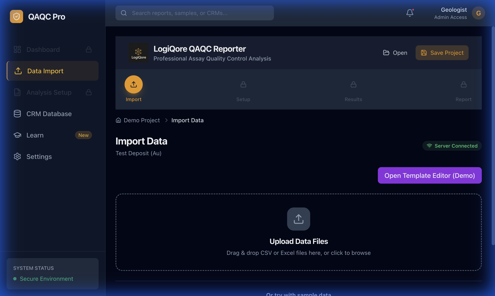

---

## 2. Data Import

**Purpose:** Verify that users can import CSV/XLSX files and use sample data.

### Test Steps
1.  Navigate to **Data Import** (sidebar).
2.  **Option A (Upload):**
    *   Drag-and-drop a CSV/XLSX file into the upload zone.
    *   Verify the data preview table appears.
    *   Map columns if prompted.
3.  **Option B (Sample Data):**
    *   Scroll down to "Or try with sample data".
    *   Click **"Gold Fire Assay"**.
4.  Verify the app transitions to **Analysis Setup**.

### Video Recording
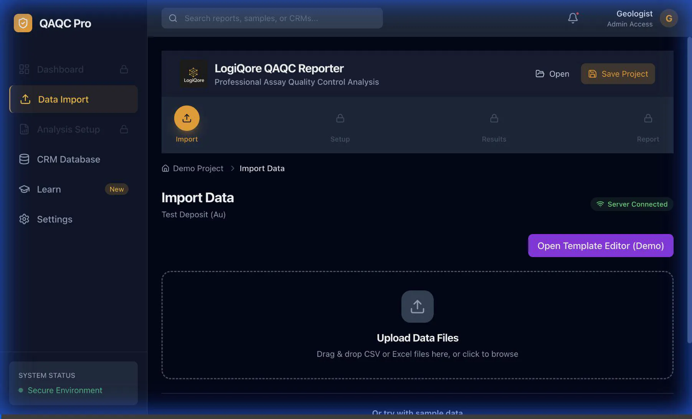

### Screenshot
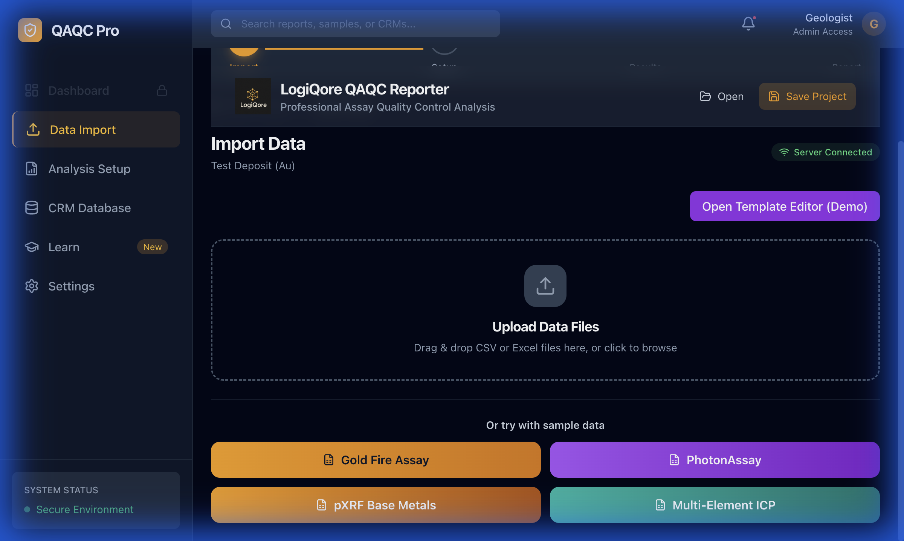

---

## 3. Analysis Setup

**Purpose:** Verify that users can configure analysis parameters and run analysis.

### Test Steps
1.  On the **Analysis Setup** page, select an analysis type:
    *   **Gold (Fire Assay)**
    *   **pXRF / Multi-element**
    *   **Chrysos PhotonAssay**
2.  Review **Quick Settings** (target elements for pXRF).
3.  Click **"Advanced Settings"** to view QAQC rules for Standards, Blanks, and Duplicates.
4.  Click **"Run Analysis"**.
5.  Verify the app navigates to the **Results Dashboard**.

### Video Recording
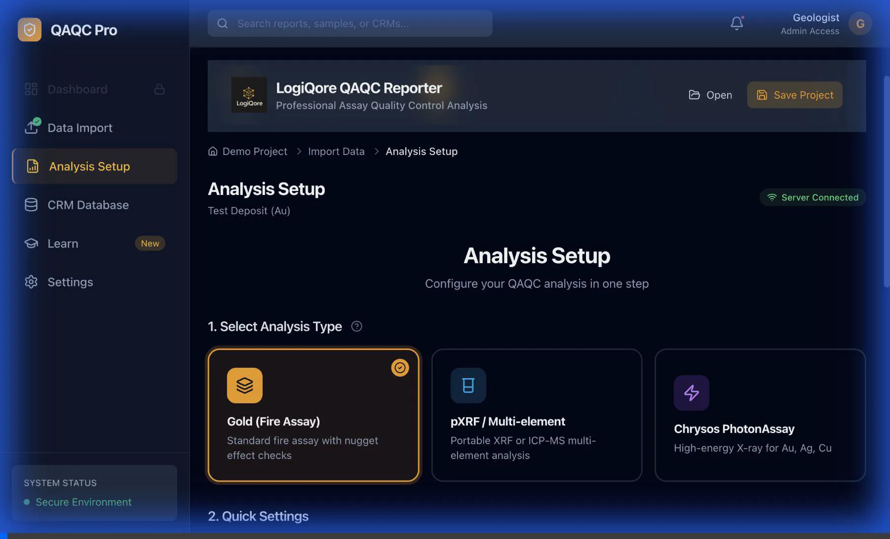

### Screenshot
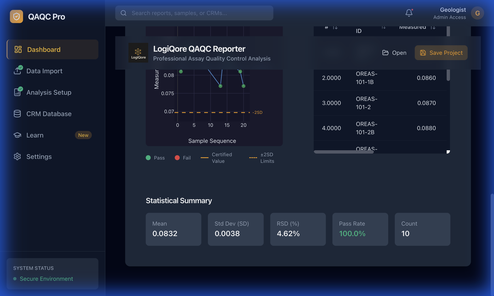

---

## 4. Results Dashboard

**Purpose:** Verify that analysis results display correctly with interactive charts.

### Test Steps
1.  Navigate to **Dashboard** (sidebar).
2.  Verify the summary cards display:
    *   **Total Samples**
    *   **Standards, Blanks, Duplicates counts**
    *   **Overall Pass Rate**
3.  Click through the tabs:
    *   **Standards:** View control chart with ±2SD lines.
    *   **Blanks:** View contamination monitor.
    *   **Duplicates:** View precision analysis.
4.  Scroll down to view the **Statistical Summary**.

### Video Recording
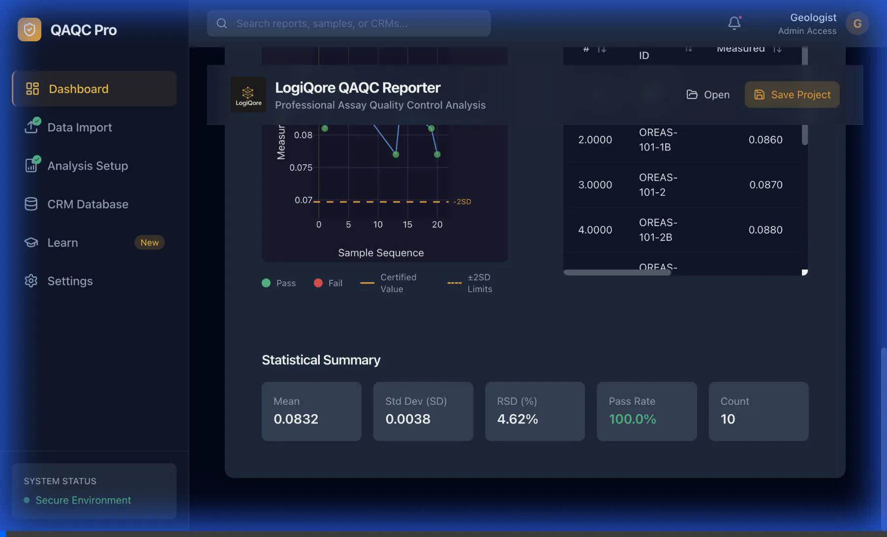

### Screenshot
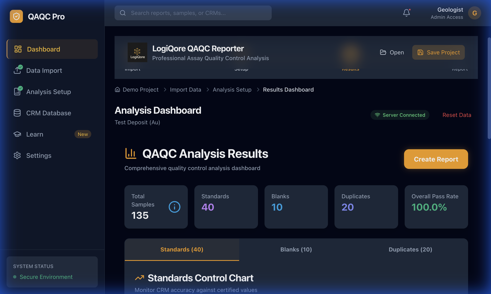

---

## 5. CRM Database

**Purpose:** Verify that the CRM database is searchable and provides details.

### Test Steps
1.  Navigate to **CRM Database** (sidebar).
2.  Verify the list shows available CRMs (41 Certified Reference Materials).
3.  Use the search bar to filter by "OREAS".
4.  Click on a CRM (e.g., **OREAS 101**) to expand details.
5.  Verify certified values and standard deviations are displayed.

### Video Recording
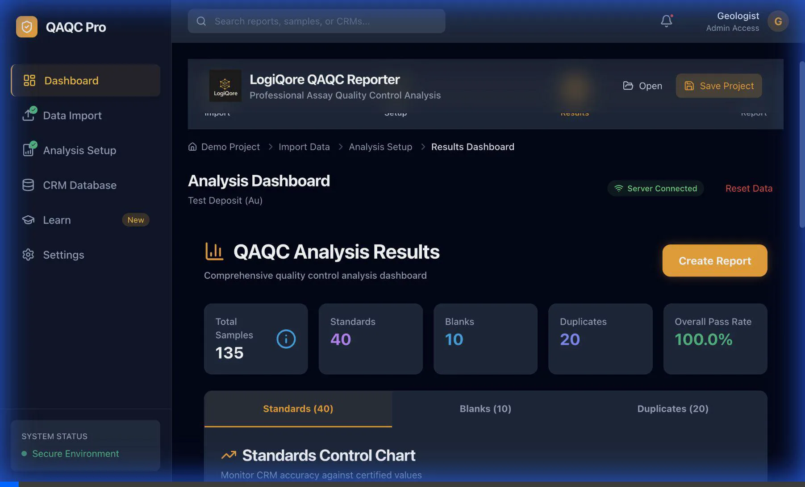

### Screenshot
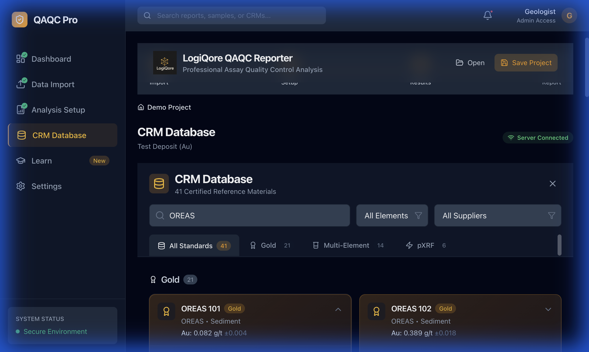

---

## 6. Settings Page

**Purpose:** Verify that application settings can be configured.

### Test Steps
1.  Navigate to **Settings** (sidebar).
2.  Verify the following sections are visible:
    *   **Default Report Format:** PDF, DOCX, XLSX toggle.
    *   **Figure Resolution (DPI):** 150/300/600 options.
    *   **Report Options:** Toggle "Include Cover Page" and "Include JORC Table 1".
    *   **Analysis Defaults:** Standards Tolerance, Precision Target, Contamination Multiplier, Failure Threshold.
3.  Verify **Backend Connection Status** shows "Connected".

### Video Recording
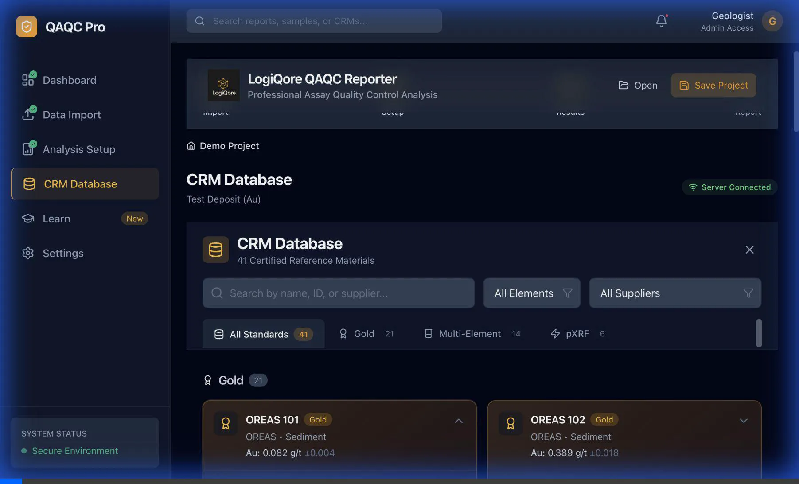

### Screenshot
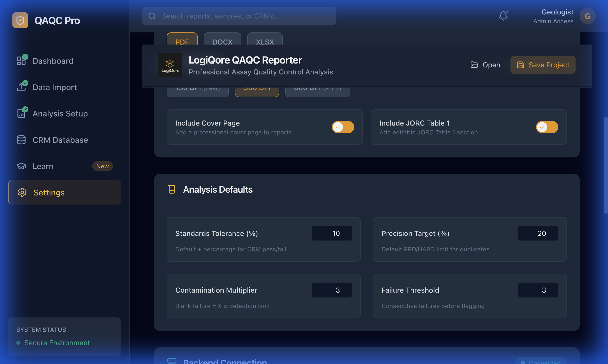

---

## 7. Report Export

**Purpose:** Verify that reports can be generated in PDF, DOCX, and XLSX formats.

### Test Steps
1.  Navigate to **Dashboard** (sidebar).
2.  Click **"Create Report"**.
3.  Select a report type:
    *   **Figures Only:** Quick presentation export.
    *   **JORC Report:** Comprehensive analysis documentation.
4.  Fill in report metadata (Author, Company, Laboratory, Title).
5.  Configure options (Color Scheme, Font Size, Page Layout).
6.  Click **"Generate JORC Report (DOCX)"**.
7.  Verify the report downloads or a success message appears.

### Video Recording
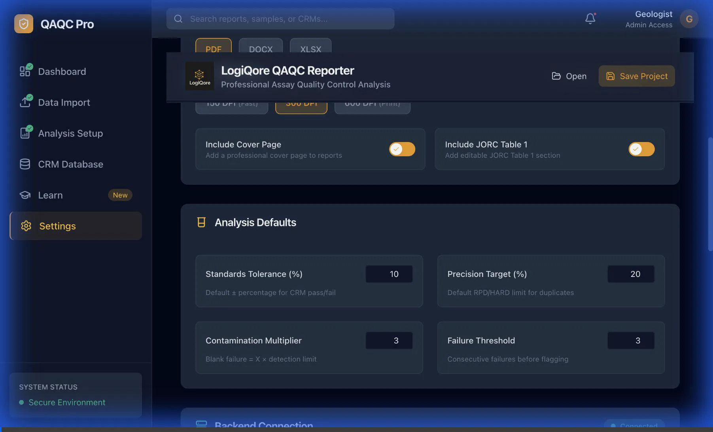

### Screenshot
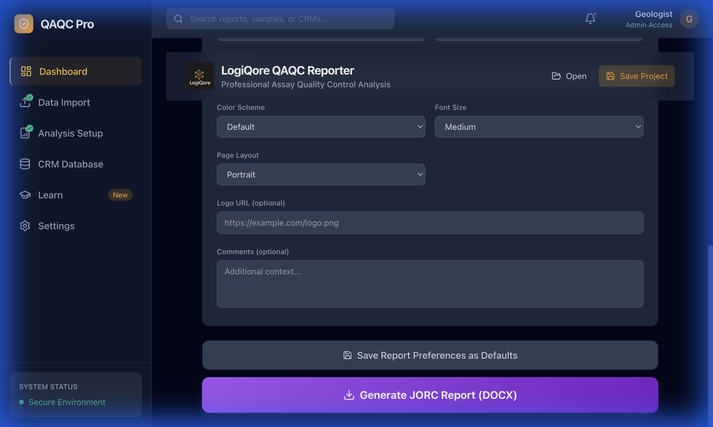

---

## 8. CLI Workflow

**Purpose:** Verify that the command-line interface processes data correctly.

### Test Steps
1.  Open a terminal in the project root.
2.  Run the basic analysis command:
    ```bash
    python3 main.py \
      --input test_assay_data.csv \
      --output output_test \
      --infer-mapping \
      --normalize-results \
      --yes \
      --include-plots
    ```
3.  Verify the following outputs in `output_test/`:
    *   `*_clean.csv` – Normalized data.
    *   `*.provenance.json` – Processing log.
    *   `qaqc_report_*.pdf` – Generated report.
    *   `plots/` – Generated visualizations.

### Expected Output
```
✓ Data imported: X rows
✓ Mapping applied
✓ Analysis complete (X passed, Y failed)
✓ Report saved to output_test/qaqc_report_*.pdf
```

---

## Quick Reference: Test Coverage Matrix

| Feature | Web UI | CLI | Desktop GUI |
| :--- | :---: | :---: | :---: |
| Session Management | ✅ | N/A | ✅ |
| Data Import | ✅ | ✅ | ✅ |
| Column Mapping | ✅ | ✅ | ✅ |
| Analysis Configuration | ✅ | ✅ | ✅ |
| Results Dashboard | ✅ | N/A | ✅ |
| CRM Database | ✅ | N/A | ✅ |
| Report Export (PDF/DOCX) | ✅ | ✅ | ✅ |
| Settings | ✅ | N/A | ✅ |

---

## Known Issues

| Issue | Workaround |
| :--- | :--- |
| React hook order error during navigation | Reload the page to recover. |
| CLI mapping may not auto-detect all columns | Use `--mapping <file.yaml>` for explicit mapping. |
